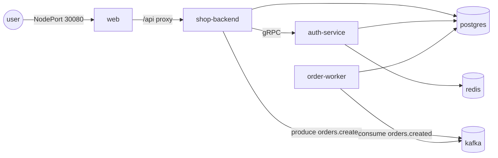

# Домашнее задание: k8s

Развёртывание учебного микросервисного приложения `shopx` (`auth-service`,
`shop-backend`, `order-worker`, `web`) и его инфраструктуры (`postgres`,
`redis`, `kafka`) в Kubernetes-кластере.

## Архитектура



Все ресурсы живут в namespace `shopx`. Stateful-компоненты (`postgres`,
`redis`, `kafka`) — `StatefulSet` + headless `Service` + PVC через
`volumeClaimTemplates`. Stateless Go-сервисы и `web` — `Deployment` +
`ClusterIP`. Снаружи доступен только `web` через `NodePort 30080`.

## Структура манифестов

```
k8s/base/
├── namespace.yaml
├── postgres/      0-secret · 1-service · 2-statefulset
├── redis/         0-service · 1-statefulset
├── kafka/         0-service · 1-statefulset · 2-job-init-topics
├── auth-service/  0-secret · 1-configmap · 2-deployment · 3-service
├── shop-backend/  0-secret · 1-configmap · 2-deployment · 3-service
├── order-worker/  0-secret · 1-configmap · 2-deployment
└── web/           0-deployment · 1-service (NodePort)
```

Файлы пронумерованы внутри компонента для удобного чтения; порядок
применения через `kubectl apply -R -f k8s/base` некритичен — controller
loop сам разрулит зависимости.

## Инициализация Kafka-топиков

`kafka/2-job-init-topics.yaml` — `Job`, который дожидается готовности
брокера и создаёт топик `orders.created` (3 партиции, replication 1) с
флагом `--if-not-exists`.

Зачем: при первом запуске возникает гонка — `order-worker` подключается
к `consumer group` раньше, чем shop-backend опубликует первое сообщение,
а значит раньше, чем сработает auto-create топика. Группа стабилизируется
с пустым subscription'ом, новый rebalance под появившуюся партицию не
триггерится, и сообщения копятся в логе никем не прочитанными.

Job решает эту гонку: топик существует ещё до того, как worker впервые
зайдёт в группу. Job идемпотентен (`--if-not-exists`), удаляется
автоматически через 5 минут после успеха (`ttlSecondsAfterFinished`).

```bash
kubectl apply -f k8s/base/kafka/2-job-init-topics.yaml
kubectl -n shopx wait --for=condition=complete job/kafka-init-topics --timeout=60s
```

После применения worker и shop-backend всегда поднимаются на готовом топике.

## Конфигурация через env

Все Go-сервисы читают параметры из переменных окружения. Имена ключей в
`ConfigMap`/`Secret` совпадают с именами env-переменных приложения — это
позволяет подключать весь набор одной строкой:

```yaml
envFrom:
  - configMapRef: { name: auth-service }
  - secretRef:    { name: auth-service }
```

Чувствительное (DSN с паролем) — в `Secret`, остальное — в `ConfigMap`.
Флаги CLI остаются и переопределяют env (приоритет: flag > env > default).

| Сервис         | ConfigMap                                                                              | Secret                |
| -------------- | -------------------------------------------------------------------------------------- | --------------------- |
| `auth-service` | `AUTH_LISTEN`, `AUTH_REDIS_ADDR`                                                       | `AUTH_POSTGRES_DSN`   |
| `shop-backend` | `SHOP_LISTEN`, `SHOP_AUTH_GRPC`, `SHOP_KAFKA_BROKERS`, `SHOP_ORDERS_TOPIC`             | `SHOP_POSTGRES_DSN`   |
| `order-worker` | `WORKER_KAFKA_BROKERS`, `WORKER_ORDERS_TOPIC`, `WORKER_GROUP_ID`, `WORKER_CONCURRENCY` | `WORKER_POSTGRES_DSN` |

## Образы и реестр

Образы публикуются в **GitHub Container Registry**: `ghcr.io/egortarasov/k8s-hw/<service>:dev`.

```bash
# единоразово: логин в ghcr (нужен PAT с write:packages)
export GITHUB_TOKEN=$(security find-generic-password -s ghcr-token -w)
make docker-login

# собрать и запушить все образы (auth-service, shop-backend, order-worker, web)
make images-push

# точечно
make push-auth-service
make push-web
```

Параметры Makefile: `REGISTRY`, `OWNER`, `REPO`, `TAG` (значения по
умолчанию см. в `Makefile`).

После первого пуша пакеты в ghcr **приватные**. Сделай их публичными
(`Package settings → Change visibility → Public`) или создай в кластере
`imagePullSecret`:

```bash
kubectl -n shopx create secret docker-registry ghcr \
  --docker-server=ghcr.io \
  --docker-username=egortarasov \
  --docker-password="$GITHUB_TOKEN"

kubectl -n shopx patch sa default \
  -p '{"imagePullSecrets":[{"name":"ghcr"}]}'
```

## Развёртывание

```bash
kubectl apply -R -f k8s/base
kubectl -n shopx get pods -w
open http://localhost:30080
```

Если кластер удалённый — замени `localhost` на адрес ноды
(`kubectl get nodes -o wide`) или используй port-forward:

```bash
kubectl -n shopx port-forward svc/web 8080:80
```

## Проверка

```bash
kubectl -n shopx get all
kubectl -n shopx logs deploy/auth-service -f
kubectl -n shopx logs deploy/order-worker -f
kubectl -n shopx exec -it postgres-0 -- psql -U shopx -d shopx
```

End-to-end через nginx-прокси:

```bash
BASE=http://localhost:30080

curl -X POST $BASE/api/register \
  -H 'Content-Type: application/json' \
  -d '{"email":"alice@example.com","password":"secret123","name":"Alice"}'

TOKEN=$(curl -s -X POST $BASE/api/login \
  -H 'Content-Type: application/json' \
  -d '{"email":"alice@example.com","password":"secret123"}' \
  | jq -r .sessionToken)

curl -X POST $BASE/api/orders \
  -H 'Content-Type: application/json' \
  -H "X-Session-Token: $TOKEN" \
  -d '{"items":[{"sku":"book-1","qty":2}]}'
```

